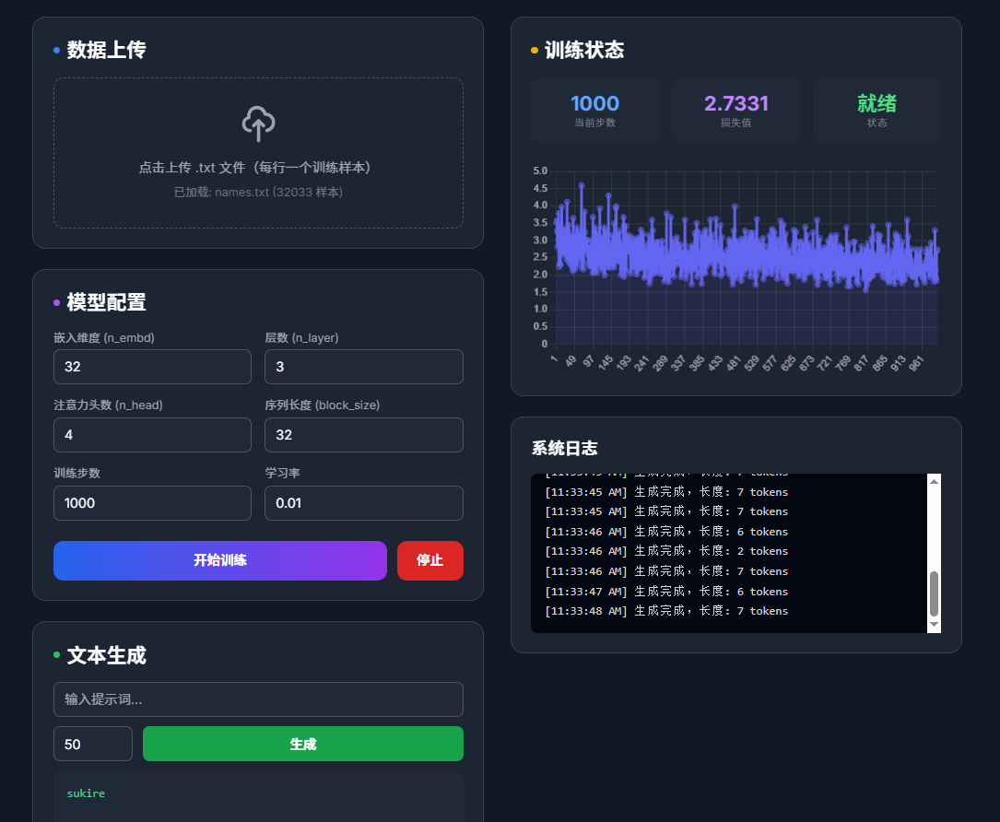
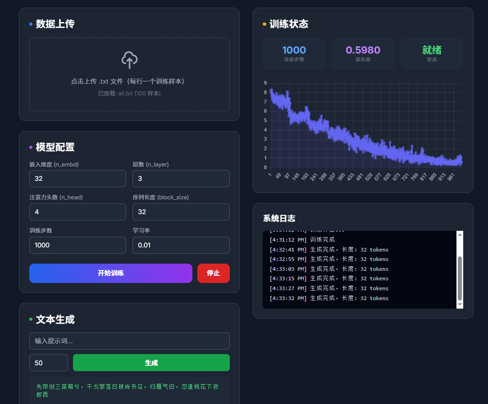

## 模型持久化与加载

- 训练完成后会自动将模型保存到 `models/latest.json`
- 服务启动时如检测到 `models/latest.json`，会自动加载该模型用于生成

### API

- `POST /api/model/import`：上传并加载模型文件（multipart/form-data，字段名 `file`）
- `GET /api/model/export`：下载当前模型（优先返回 `models/latest.json`，否则导出内存中的模型）
- `POST /api/model/save`：保存当前模型到磁盘（JSON：`{"name":"xxx.json"}`，不传则保存到 `models/latest.json`）
